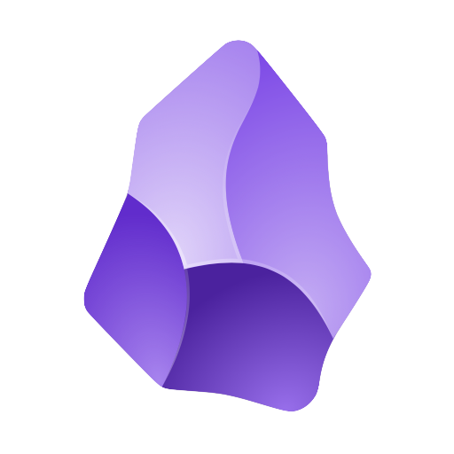

## Hi there 👋

<!--
**rodo-nunez/rodo-nunez** is a ✨ _special_ ✨ repository because its `README.md` (this file) appears on your GitHub profile.

Here are some ideas to get you started:

- 🔭 I’m currently working on ...
- 🌱 I’m currently learning ...
- 👯 I’m looking to collaborate on ...
- 🤔 I’m looking for help with ...
- 💬 Ask me about ...
- 📫 How to reach me: ...
- 😄 Pronouns: ...
- ⚡ Fun fact: ...
-->

I'm Rodo, I like to learn a lot and transfer that learning to others, se we can do things in a better way and understanding why we do things.

Here you will mostly see me working in Open Source Data Science and MLOps projects and classes. 

In my pinned repos you can find some presentations, classes, and template projects. Although most of my real work is private

- 📫 How to reach me: [LinkedIn](https://www.linkedin.com/in/rodonunez/)
- 📺 **En_coders** podcast and content about Data Science: [YouTube](https://www.youtube.com/@en_coders/videos), [Twitch](https://www.twitch.tv/en_coders)

## 🔨 Main languageas and tools:

This is far from all of the tools I use, but I use these tools every week, some weeks it's even everyday. I use these tools to create analytics products and/or to give classes.

    

        
        
        
        
        
        
        
        
        
        
      

---

## Organizations

    

        
        
        
        
      

---

<!-- ### 📊 My GitHub Stats :

 -->